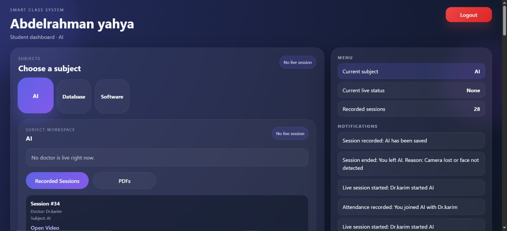
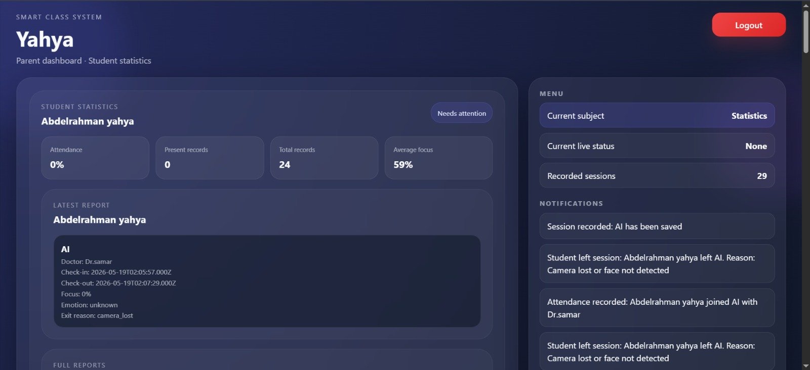
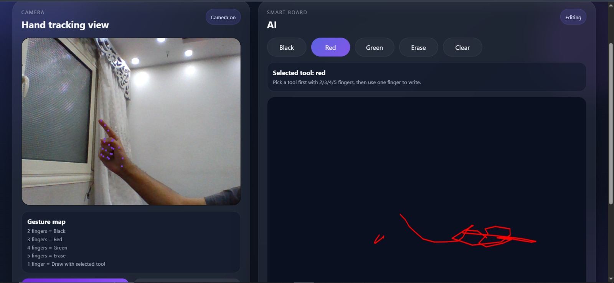
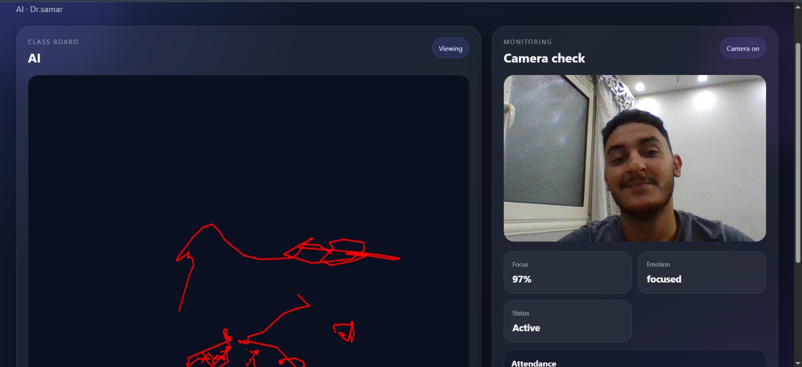
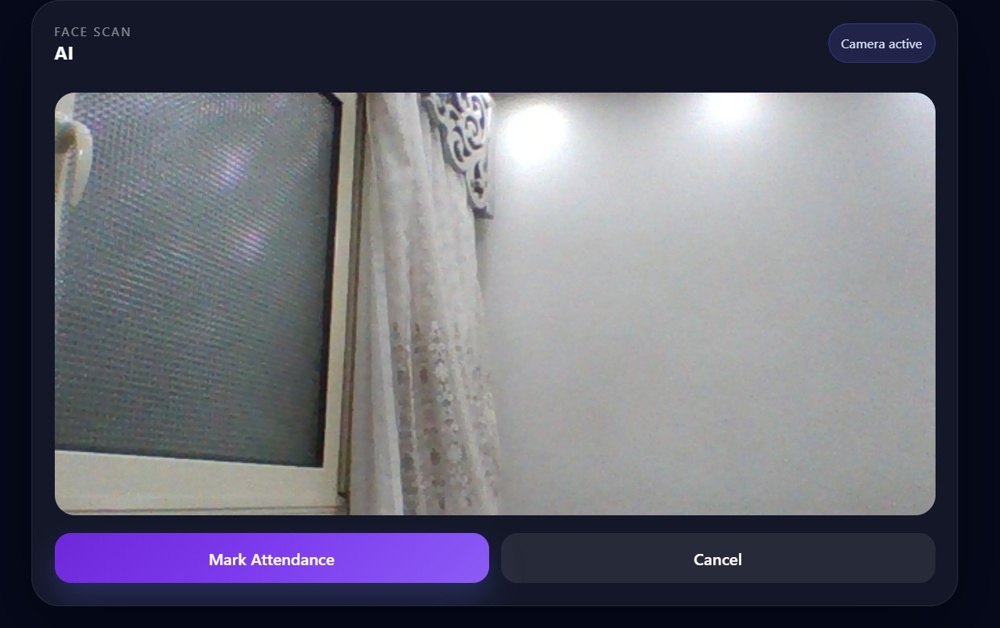
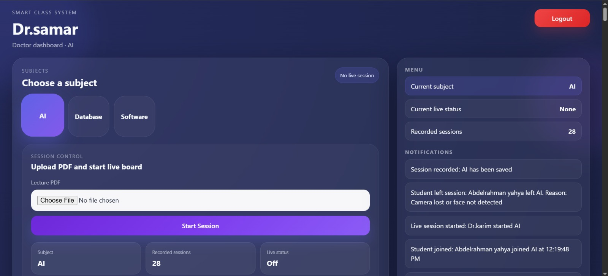

# AI Smart Classroom System

An AI-powered smart classroom web application integrating face recognition, emotion detection, smart board interaction, and educational management features.

## Features
- Face recognition attendance system
- Student focus and emotion detection
- Smart board hand gesture interaction
- Teacher and parent dashboards
- Session recording and summaries
- Role-based login system
- Database integration

## Screenshots

### Login Page

### Student Dashboard

### Parent Dashboard

### Smart Board Interaction

### Emotion Detection

### Face Recognition

### Doctor Dashboard

## Technologies Used
- React.js
- Node.js
- Express.js
- MongoDB / Database
- AI & Computer Vision Concepts

## Future Improvements
- Telegram bot integration
- Advanced analytics
- Real-time notifications
- Enhanced AI monitoring

## Author
Abdelrahman Yahya
